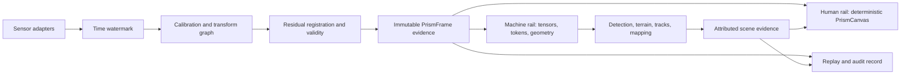

# OpenPRISM Reference Architecture

Status: pre-standard reference design, version 0.1, September 2026.

## 1. Design thesis

The breakthrough is not a prettier blend. It is a change in what the system
considers canonical:

> A fused image is one reversible projection of evidence. It is never the
> evidence itself.

Visible imagery, thermal radiance, depth, lidar, radar, event streams, pose,
and model output have different units, resolutions, clocks, failure modes, and
users. Flattening them into one RGB raster destroys exactly the information
needed to understand disagreement. OpenPRISM therefore creates one canonical
`PrismFrame` and derives two synchronized rails from it.



This design follows the state-estimation principle that asynchronous sensors
must be modeled with their own sample rates and uncertainty, not treated as
interchangeable snapshots. The local engineering corpus grounds this in Beard
and McLain's state-estimation treatment and MIT 16.485 Visual Navigation,
Lecture 26, which frames camera, inertial, GPS, and lidar as complementary
odometry/mapping sources rather than display layers.

## 2. Three novel operating concepts

### 2.1 Pixel Passport

Every derived pixel or feature retains:

- source observation IDs;
- source timestamps and age;
- calibration and transform version;
- registration validity and uncertainty;
- contribution weights;
- physical units or an explicit `uncalibrated` marker;
- algorithm/model/configuration version; and
- degraded-mode gates applied.

The reference implementation exposes `thermal_contribution`,
`sensor_validity`, `registration_support_score`, and `fusion_support_score` as
named machine channels. Registration support is always source-qualified in
provenance: the staged archives carry a publisher-declared prior, not an
empirically measured confidence. The candidate schema generalizes these into
assets and a W3C PROV-compatible processing graph.

### 2.2 No-Fusion Zone

Pixel overlay is forbidden where spatial or temporal support is insufficient.
The renderer falls back to the trustworthy reference sensor while preserving
late-fused detections, raw-source access, and an Integrity view. It does not
inpaint, hallucinate, or show double silhouettes as though they were evidence.

Initial engineering gates for field tuning are:

- stop pixel fusion when motion projected through timestamp uncertainty is
  greater than approximately 0.5 pixel; and
- stop pixel fusion where estimated reprojection uncertainty is greater than
  approximately 1 pixel.

These are proposed starting points, not requirements copied from a standard.
They must be tuned from optics, range, scene motion, and mission risk.

### 2.3 Evidence Lens

Operators need one stable scene, not a wall of competing feeds. A
coordinate-locked lens temporarily reveals the raw registered modality under
the pointer. It makes disagreement inspectable without forcing the operator to
mentally correlate separate panes. The raw path remains independent of the
fusion/model path so a fusion failure cannot remove the operator's escape hatch.

## 3. Canonical frame bundle

A production `PrismFrame` has six planes.

| Plane | Required content |
| --- | --- |
| Observation | Immutable payload, sensor/modality ID, encoding, units, spectral band, exposure, validity, health |
| Time | TAI capture start/mid/end, clock domain, uncertainty, ingress and presentation time, pairing state |
| Geometry | CRS, reference frame, intrinsics, distortion, versioned transforms, covariance, valid interval |
| Quality | Registration residual, no-data/FOV/occlusion masks, staleness, latency, OOD and degraded-state flags |
| Evidence | Detections, masks, terrain, tracks, alerts, source type, class distribution, spatial uncertainty, age |
| Provenance | Source hashes, calibration IDs, model/configuration IDs, processing graph, operator actions |

Physical measurement uncertainty and ML confidence are different quantities
and MUST NOT be collapsed into one percentage.

The portable candidate is
[`openprism/spec/prism-frame.schema.json`](../spec/prism-frame.schema.json).
High-rate runtime bindings should use typed DDS/RTPS or equivalent IDL and
reference zero-copy payloads rather than embedding arrays in JSON.

The schema is the **portable Frame Bundle target**, not a serialization of the
current lightweight Python dataclasses. The in-memory `Timestamp`,
`SensorObservation`, `PrismFrame`, and `FusionOutput` objects support the
reference fusion demonstration, but they do not yet materialize every portable
field, referenced asset, hash, capture interval, health state, calibration
reference, or processing activity required by the schema. An in-memory frame
or operator API response therefore MUST NOT be described as a schema-conforming
Frame Bundle. The next interoperability increment requires a serializer that
writes and hashes payload/validity/uncertainty assets, constructs the complete
bundle metadata, validates it against Draft 2020-12, and round-trips it through
an independent reader.

The extracted research pairs do not carry authoritative capture time. The
runtime therefore uses `tai_ns=None` and `uncertainty_ns=None`; it does not
encode unknown time as a plausible numeric instant.
A portable bundle with unknown archive time uses JSON `null` for unavailable
TAI and uncertainty fields, declares `pairing_state: "unknown"`, and records
the missing-time condition in quality/provenance. Zero is valid only when a
traceable source actually establishes that timestamp and its uncertainty.

## 4. Sensor ingestion and synchronization

Each adapter emits a `SensorObservation` with a hardware-oriented timestamp.
Adapters are modality-specific but the envelope is stable. Initial bindings:

- visible, NIR, MWIR, and LWIR image cameras;
- depth cameras and projected point clouds;
- scanning/solid-state lidar;
- imaging or object-list radar;
- event-camera packets or reconstructed intervals;
- IMU, GNSS, barometer, wheel/air odometry, and platform/gimbal pose;
- SAR or hyperspectral rasters; and
- derived upstream detections with explicit provenance.

The watermark buffer never silently chooses a nearest frame. It marks each
selection `exact`, `interpolated`, `late`, or `missing`, records signed skew,
and decides whether pixel fusion is eligible. IMU/pose interpolation and image
motion compensation are plugins, not hidden behavior.

Required live metadata includes exposure midpoint, rolling-shutter line timing,
clock source/domain, holdover state, time uncertainty, ingress time, and age.

## 5. Transform and calibration graph

The normative direction is:

```text
Earth/ECEF → map → odom → platform/base_link → gimbal → sensor → optical
```

Transforms carry parent/child direction, handedness, axis convention, SI units,
quaternion ordering, covariance, source, calibration ID, valid interval, and
focus/zoom/temperature regime. Online refinement creates a new calibration
epoch; it never overwrites factory calibration.

Registration is hierarchical:

1. factory/field intrinsics and extrinsics provide the geometric prior;
2. pose, depth, and rolling-shutter timing project each observation into the
   reference/world geometry;
3. a modality-invariant matcher estimates residual correspondences;
4. robust geometry rejects outliers and estimates a residual warp/flow;
5. cycle consistency, occlusion, FOV, and residual statistics produce a
   per-pixel validity and uncertainty map; and
6. low-support regions abstain from pixel fusion.

The current implementation supports declared identity and edge-domain integer
phase translation. Production candidates include
[XoFTR](https://openaccess.thecvf.com/content/CVPR2024W/IMW/html/Tuzcuoglu_XoFTR_Cross-modal_Feature_Matching_Transformer_CVPRW_2024_paper.html)
and
[MINIMA](https://openaccess.thecvf.com/content/CVPR2025/html/Ren_MINIMA_Modality_Invariant_Image_Matching_CVPR_2025_paper.html),
followed by calibrated geometry/RANSAC and uncertainty estimation. The 2026
[SFRF paper](https://arxiv.org/abs/2605.13049) is useful evidence that error
accumulation and registration uncertainty must be coupled to fusion.

## 6. Radiometric and quality normalization

OpenPRISM preserves raw measurements and creates normalized derivatives.

Visible preprocessing records color space, transfer function, exposure, white
balance, saturation, blur, and dynamic-range limits. Thermal preprocessing
records sensor band, NUC state, bad-pixel mask, integration time, sensor
temperature, radiometric response, emissivity/environment assumptions, and
saturation/blooming.

`temperature` units MUST only be shown when the end-to-end calibration supports
them. Caltech thermal16 in this repository is correctly represented as
`raw_sensor_count`; the operator receives `relative thermal intensity`.

## 7. Machine rail

The machine consumer never receives only the operator bitmap. The reference
tensor has 11 named channels:

```text
visible_r_srgb
visible_g_srgb
visible_b_srgb
thermal_radiometric_norm
visible_detail
thermal_detail
thermal_saliency
sensor_validity
registration_support_score
thermal_contribution
fusion_support_score
```

Production models should use modality-specific encoders with gated exchange at
multiple depths, then task heads for people/vehicle detection, terrain
segmentation, tracking, depth, mapping, and open-vocabulary retrieval. They
should retain source-specific features, validity, age, and uncertainty.

Current primary research supports this direction:

- [MRFS, CVPR 2024](https://openaccess.thecvf.com/content/CVPR2024/html/Zhang_MRFS_Mutually_Reinforcing_Image_Fusion_and_Segmentation_CVPR_2024_paper.html)
  couples fusion and segmentation rather than optimizing only image appearance.
- [VIFA, ACCV 2024](https://openaccess.thecvf.com/content/ACCV2024/html/Shi_VIFA_An_Efficient_Visible_and_Infrared_Image_Fusion_Architecture_for_ACCV_2024_paper.html)
  addresses shared and task-specific knowledge across multiple applications.
- [M-SpecGene, ICCV 2025](https://openaccess.thecvf.com/content/ICCV2025/html/Zhou_M-SpecGene_Generalized_Foundation_Model_for_RGBT_Multispectral_Vision_ICCV_2025_paper.html)
  demonstrates large-scale RGBT pretraining and cross-task transfer.
- [UMFNet, CVPR 2026](https://openaccess.thecvf.com/content/CVPR2026/html/Wang_Uncertainty-Aware_Modality_Fusion_for_Unaligned_RGB-T_Salient_Object_Detection_CVPR_2026_paper.html)
  explicitly gates unaligned RGB-T evidence with learned uncertainty.
- [Tri-Modal Fusion Transformers, CVPR 2026](https://openaccess.thecvf.com/content/CVPR2026/html/Iaboni_Tri-Modal_Fusion_Transformers_for_UAV-based_Object_Detection_CVPR_2026_paper.html)
  studies RGB/thermal/event exchange depth for aerial detection.
- [Thermal-Det, CVPR 2026](https://openaccess.thecvf.com/content/CVPR2026/html/Ranasinghe_Thermal-Det_Language-Guided_Cross-Modal_Distillation_for_Open-Vocabulary_Thermal_Object_Detection_CVPR_2026_paper.html)
  transfers language-aligned knowledge to open-vocabulary thermal detection.

Training MUST include sensor dropout, stale frames, misregistration, blur,
saturation, NUC drift, missing calibration, parallax, timestamp skew, and
out-of-distribution sensor families. Missing-modality work such as
[M3L, WACV 2024](https://openaccess.thecvf.com/content/WACV2024/html/Maheshwari_Missing_Modality_Robustness_in_Semi-Supervised_Multi-Modal_Semantic_Segmentation_WACV_2024_paper.html)
shows why this is a core objective, not an edge case.

## 8. Human rail

The operator compositor is deterministic, low latency, non-generative, and
reversible. The default preserves visible chroma, introduces thermal evidence
through locally weighted luminance, and uses a restrained high-thermal cue.
Boxes, masks, tracks, confidence, and health remain separate layers.

Four task presets share one stable viewport:

- **Navigate:** visible structure and color with restrained thermal evidence;
- **Search:** increased thermal emphasis and prominent people/vehicle contours;
- **Terrain:** semantic terrain classes over the same geometry;
- **Integrity:** registration/fusion support and degraded-state inspection.

The display MUST identify ground truth, model output, predicted/coasting tracks,
and operator-confirmed facts using text and shape/line style, not color alone.
Automatic palette or mode changes MUST be visible and auditable.

The FAA Remote Pilot sUAS Study Guide, pages 72–73 in the local corpus, warns
that workload, stress, and fixation on one item degrade situational awareness.
The stable canvas, compact health state, and hold-to-reveal lens are deliberate
countermeasures. Preference research also shows why one rendering cannot serve
every user: [DPOFusion, CVPR 2026](https://openaccess.thecvf.com/content/CVPR2026/html/Su_Fusion_in_Your_Way_Aligning_Image_Fusion_with_Heterogeneous_Demands_CVPR_2026_paper.html)
separates human, VLM, detection, and segmentation demands, while
[EVAFusion, CVPR 2026](https://openaccess.thecvf.com/content/CVPR2026/html/Liu_Bridging_Human_Evaluation_to_Infrared_and_Visible_Image_Fusion_CVPR_2026_paper.html)
shows the gap between handcrafted image metrics and human evaluation.

Generative RGB↔thermal translation may be used as an offline research teacher
or explicitly labeled synthetic channel. It MUST NOT be displayed or recorded
as measured heat.

## 9. Evidence and state loop

Model results return to the same scene state as attributed evidence:

```text
observation → alignment → machine features → detection/segmentation/track
            ↘ operator rendering ← evidence + uncertainty + provenance
```

Each detection or terrain region carries a class distribution, source type,
contributing sensor IDs, spatial uncertainty, age, state (`observed`,
`predicted`, `coasting`, `operator_confirmed`), and OOD/quality flags. Operator
corrections are stored separately from ground truth and training data until a
review workflow accepts them.

## 10. Degraded-state behavior

The proposed state machine is:

```text
NOMINAL → DEGRADED → UNSYNCHRONIZED / UNREGISTERED / STALE → LOST
    ↘ TEST_REPLAY
```

Key transitions:

- excess time or registration uncertainty: pixel fusion off, Integrity warning,
  late/object fusion retained;
- RGB loss: explicitly labeled thermal-only mode;
- thermal loss: explicitly labeled RGB-only mode with low-light caveat;
- invalid geolocation: keep image-space evidence, suppress map coordinates;
- stale frame: hatch/blank with last-good time and age, never masquerade as live;
- OOD or uncalibrated model: tentative evidence only; and
- recovery: hysteresis and health checks prevent flicker between states.

Every transition is logged in the provenance graph and verified with injected
faults. Raw-view and health indication paths SHOULD not share the same failure
path as learned fusion.

## 11. Why the three datasets remain separate

LLVIP, MSRS, and Caltech represent different sensors, scenes, tasks, and legal
terms. They are adapters and cross-domain test sets, not one homogeneous pool.

- LLVIP: aligned nighttime/daytime pedestrians and VOC boxes;
- MSRS: road scenes with semantic and small detection subsets; and
- Caltech: aerial natural terrain, raw 16-bit thermal counts, masks, and severe
  geographic/temporal domain shift.

Caltech splits MUST be grouped by flight/scene to avoid leakage. Cross-dataset
evaluation should hold out entire sensor/scenario families and report visible,
thermal, rendered-fusion, and machine-rail baselines separately.

## 12. Production evolution

The next production increments are:

1. real camera/IMU/GNSS adapters with PTP hardware timestamps;
2. a versioned calibration registry and 3D transform service;
3. depth/pose-aware residual registration with covariance;
4. temporal buffer, optical/scene flow, and rolling-shutter compensation;
5. modality-specific perception backbones with missing-sensor training;
6. calibrated detection/terrain/tracking heads and contribution ablations;
7. DDS/WebRTC/MISB/OGC bindings and signed export provenance;
8. fault injection, operator studies, and cross-vendor conformance recordings;
9. two independent implementations and public plugfests; and
10. safety case and certification tailored to the deployment domain.

The reference code proves the contract and interaction model. It deliberately
does not pretend that three aligned research archives validate live calibration,
real-time transport, all sensor types, human factors, or safety certification.
