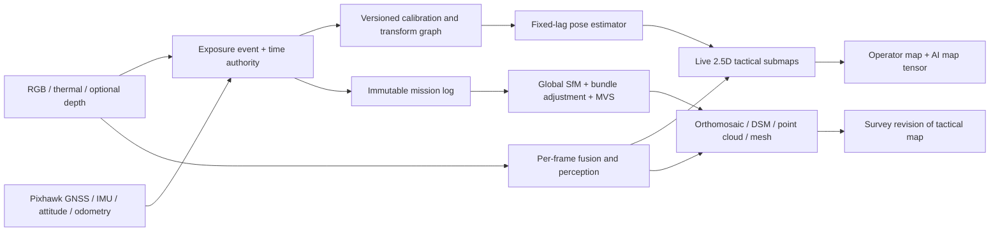

# OpenPRISM Terrain Mapping Architecture

Status: candidate engineering design plus reference vertical slice, version 0.2,
September 2026.

This document defines **PRISM Atlas**, the proposed geospatial extension of
OpenPRISM. Its purpose is to turn synchronized RGB, thermal, navigation, and
derived perception evidence into a virtual terrain map that is useful both to
an onboard model and to a human operator.

The design has two deliberately different products:

1. a real-time, uncertainty-aware **2.5D tactical mosaic** during flight; and
2. a post-flight, survey-oriented **SfM/MVS reconstruction** containing an
   orthomosaic, elevation products, point cloud, and mesh.

One algorithm cannot honestly provide both the latency of the first and the
global consistency of the second. Both products therefore share the same raw
evidence, calibration registry, transform graph, and provenance, but use
different optimization horizons.

The labels below distinguish evidence from design:

- **Published fact** means the statement is supported by a linked primary or
  official source.
- **OpenPRISM proposal** means it is an engineering choice for this project,
  not a claim made by that source or a requirement from an approved standard.
- **Acceptance gate** means the implementation must demonstrate the stated
  behavior before the corresponding capability can be claimed.

## 1. What the Caltech CART work did—and did not do

**Published fact.** The [CART paper](https://arxiv.org/pdf/2403.08997),
[CaltechDATA record](https://data.caltech.edu/records/cks6g-ps927), and
[publisher repository](https://github.com/aerorobotics/caltech-aerial-rgbt-dataset)
describe a data-collection and benchmarking project. The platform captured
synchronized RGB, long-wave thermal, GPS, and IMU streams in varied natural
terrain. The paper reports three cameras, a 200 Hz VectorNav VN100 IMU, a 5 Hz
u-blox M8N GPS, hardware synchronization by a dedicated signal generator, a
rigid sensor mount, and additional UAV position/attitude estimates at 20 Hz
with onboard RTK GPS when airborne. Camera/IMU calibration used Kalibr, and
the RGB-thermal pairs were stereo rectified from calibrated camera matrices.

**Published fact.** CART benchmarked thermal and RGB-T semantic segmentation,
RGB-to-thermal translation, and motion estimation. Its motion experiment ran
VINS-Fusion in VIO and loop-closure SLAM modes and OpenVINS in VIO mode, then
reported Absolute Trajectory Error on selected clipped sequences. It also
reported failures from fast aerial motion, feature-poor natural terrain,
water, and reflections. The paper says the data may support future
terrain-relative navigation.

**Important distinction.** CART did **not** present the exact product specified
here: a continuously updated operator map plus a post-flight RGB/thermal
orthomosaic, DSM, and semantic world model. Its SLAM benchmark estimated and
evaluated camera motion. SLAM in an algorithm name does not by itself imply a
survey map or orthorectified geospatial deliverable.

The staged `data/Caltech_Aerial_RGBT` archive in this repository is the labeled
paired-image subset. It is suitable for RGB-T registration and semantic
experiments, but it does not contain the complete neighboring image, trigger,
IMU, and navigation history needed to reconstruct a flight. PRISM Atlas replay
development will require selected raw CART trajectory bags from the official
CaltechDATA record or new synchronized flight logs.

## 2. Product definition: one evidence base, two speeds



| Property | Tactical lane | Survey lane |
| --- | --- | --- |
| Availability | During flight | After a flight or completed segment |
| Optimization horizon | Fixed-lag poses plus deformable local submaps | Full mission/global bundle adjustment |
| Surface model | 2.5D elevation/occupancy tiles; optional coarse depth | Dense point cloud, DSM/DTM, mesh |
| Visual product | Rapid orthographic mosaic with confidence and age | Georeferenced orthomosaic and textured geometry |
| Accuracy statement | Operational estimate with visible uncertainty | Measured against independent checkpoints |
| Failure behavior | Stop integrating unsafe pixels; retain raw view | Reject/flag weak components and issue QA report |
| Primary consumer | Operator and onboard AI | Analyst, GIS, training, mission archive |

**OpenPRISM proposal.** The live product is called a *tactical terrain twin*,
not a survey orthophoto. The survey product may only be called survey-grade
after mission-specific checkpoint testing. RTK, GPS tags, or a visually clean
mosaic alone do not establish accuracy.

### 2.1 Current repository implementation boundary

The checked-in reference runtime now implements the strict Pixhawk capture
bridge, explicit clock/datum/frame gates, flat-ground or supplied-height-field
ray projection, terrain-visibility uncertainty probes, bounded weighted mosaic,
mission-fixed thermal and semantic contracts, separate time-bounded object
observations, immutable hash-verified bundle generations, and the Atlas operator
view with freshness state.

It does **not** yet implement the fixed-lag visual-inertial factor graph in
Section 3.1, online loop-closure deformation, learned terrain segmentation,
depth/MVS, or bundle adjustment. Its `height_enu_m` layer is the observed
intersection height of the configured plane/DEM, not a newly reconstructed
surface. The survey-preparation path hands original overlapping images and
geolocation priors to OpenDroneMap; successful reconstruction and independent
checkpoint QA remain separate steps. The checked-in `openprism/survey.py` and
`tooling/prepare_openprism_survey.py` implement this deterministic preparation
boundary; neither one turns GPS positions into terrain geometry.

## 3. PRISM Atlas real-time algorithm

### 3.1 State estimator

The estimator maintains keyframe state

```text
x_k = {T_map_body(k), velocity(k), gyro_bias(k), accel_bias(k)}
```

and minimizes a robust factor-graph objective of the form

```text
Σ IMU-preintegration residuals
+ Σ RGB feature reprojection residuals
+ Σ trusted thermal/cross-modal feature residuals
+ Σ GNSS position residuals with covariance
+ Σ altitude/range/DEM residuals
+ Σ loop-closure residuals
```

**OpenPRISM proposal.** Use RGB as the primary geometry carrier because it
usually supplies the most stable spatial features. Thermal feature factors are
added only where calibrated alignment, spatial distribution, contrast, and
track consistency pass policy. A neural RGB-T fusion bitmap is never used as
the only geometric measurement. Terrain classes, sky, water, reflections,
people, and vehicles may mask or downweight features that violate a static
scene assumption.

For an initial implementation, either of these paths is valid:

- treat Pixhawk `ODOMETRY`/local pose as a covariance-bearing prior and add
  visual relative-pose and loop factors on the companion computer; or
- consume hardware-timestamped, high-rate IMU samples and perform tightly
  coupled visual-inertial preintegration with GNSS factors.

The first path is simpler and is explicitly **loosely coupled**. The second can
be more accurate but requires a trustworthy IMU noise model, camera–IMU
extrinsics, temporal calibration, and high-rate measurements. MAVLink packet
arrival time is not an exposure or IMU measurement timestamp.

[VINS-Fusion](https://github.com/HKUST-Aerial-Robotics/VINS-Fusion) is a useful
baseline because it supports mono/stereo visual-inertial estimation, online
camera–IMU spatial and temporal calibration, loop closure, and an example of
GPS fusion. [OpenVINS calibration guidance](https://github.com/rpng/open_vins/blob/master/docs/gs-calibration.dox)
is particularly relevant: it warns that small timestamp errors can quickly
degrade dynamic trajectories and calls for accurate intrinsics, extrinsics,
IMU noise, and timestamps. These are research baselines, not drop-in evidence
that our specific payload is calibrated or safe. Their licenses and interfaces
must be reviewed before production integration.

For a clean-room PRISM Atlas implementation, an incremental fixed-lag factor
graph is the recommended structure. [GTSAM's fixed-lag documentation](https://borglab.github.io/gtsam/fixedlagsmootherexample/)
explains bounded-history smoothing, while its
[IMU preintegration documentation](https://borglab.github.io/gtsam/preintegratedimumeasurements/)
and [navigation module](https://borglab.github.io/gtsam/navigation/) document
IMU, GNSS, and barometric factors. The local drone corpus reinforces this
architecture: [MIT 16.485 Lecture 26](https://ocw.mit.edu/courses/16-485-visual-navigation-for-autonomous-vehicles-vnav-fall-2020/d8ad590af123654c962a31765bae7e82_MIT16_485F20_lec26.pdf)
treats camera, IMU, GPS, and lidar as complementary odometry/mapping sources,
and Beard/McLain's [MAV text](https://www.et.byu.edu/~beard/classes/ece674/uavbook.pdf)
shows why slow GPS updates alone are not a satisfactory dynamic state estimate.

### 3.2 Surface intersection and 2.5D tile state

Each accepted camera pixel is undistorted, converted to a camera ray,
transformed through `camera → body → map`, and intersected with the best
available surface hypothesis:

1. measured depth or lidar, if present and valid;
2. local multi-view depth/elevation accumulated from earlier keyframes;
3. a datum-compatible DEM; or
4. a locally estimated ground plane as the lowest-capability fallback.

A ray that does not intersect a supported surface is not placed on the map.
Near-horizontal rays, sky, unknown gimbal pose, and depth discontinuities must
abstain instead of being projected to an arbitrary distance.

Each map cell is a distribution, not a colored pixel:

```text
AtlasCell = {
  elevation_mean, elevation_variance, occupancy,
  rgb_appearance_summary,
  thermal_observation_series,
  semantic_dirichlet_parameters,
  observation_time_range, last_seen,
  geometry_support, radiometric_support, semantic_support,
  source_observation_ids, calibration_epoch, transform_epoch
}
```

The projection covariance is propagated with Jacobians from pose, calibration,
timestamp, and surface/depth uncertainty. A proposed integration weight is

```text
w_i = validity_i × registration_i × view_angle_i × recency_policy_i
      / max(projected_variance_i, variance_floor)
```

with robust residual clipping so one bad pose cannot repaint a tile. The exact
weight law and thresholds are commissioning parameters, not published facts.

Semantic probabilities are accumulated as weighted Dirichlet evidence rather
than majority-vote labels. RGB appearance uses view/exposure-aware robust
statistics. Elevation uses an uncertainty-weighted robust update with an
explicit multi-surface or obstacle flag where a single-height model is invalid.

### 3.3 Reversible submaps and World Pixel Passports

**OpenPRISM proposal.** Never bake the live map into one irreversible canvas.
Keyframes contribute to small local submaps. The pose graph stores the
versioned transform of every submap. When GNSS, loop closure, or batch
optimization moves a pose, Atlas can re-place or regenerate affected tiles from
their source observations instead of smearing a corrected image over an old
one.

This extends the OpenPRISM Pixel Passport into a **World Pixel Passport**. A
displayed map cell can reveal which frames, sensors, poses, calibration epoch,
surface assumption, and model version created it. The operator can open the
original RGB and thermal evidence at the selected world coordinate.

### 3.4 Thermal is a time-varying field

A single timeless “thermal texture” is physically misleading. Apparent thermal
signal varies with time of day, weather, sensor gain/NUC state, viewing angle,
emissivity, reflected radiation, range, and atmosphere. CART explicitly
examines thermal inversion and uses a non-radiometric camera.

**OpenPRISM proposal.** Atlas stores thermal observations by time/epoch and
acquisition conditions. The operator may request “latest supported thermal,” a
time window, or a change layer. Temperature units are allowed only when a
radiometric chain supports them. Otherwise the map says `raw sensor count` or
`relative thermal intensity`; it never labels normalized color as degrees.

### 3.5 Dynamic evidence is not terrain

People, vehicles, boats, wildlife, and other moving objects are excluded from
the persistent terrain texture and elevation update. They occupy a separate
time-indexed track layer containing class distribution, observation time,
position covariance, contributing sensors, and source frames. A stopped vehicle
does not become a permanent structure merely because it was stationary in a
few images.

## 4. Post-flight reconstruction lane

After landing, PRISM Atlas reprocesses original full-resolution evidence:

1. verify hashes, frame/trigger sequence continuity, clock solution, and
   calibration versions;
2. undistort imagery and construct the synchronized multi-camera rig;
3. estimate features/matches, camera poses, and sparse structure with GNSS
   priors and their actual covariance;
4. run global bundle adjustment and robust loop/component checks;
5. run multi-view stereo, point-cloud filtering, DSM/DTM generation, meshing,
   and orthorectification;
6. project original thermal measurements and semantic probability vectors onto
   the optimized geometry; and
7. compare against independent checkpoints and emit a QA/provenance report.

**Published fact.** [COLMAP](https://colmap.github.io/) implements Structure
from Motion followed by Multi-View Stereo. Its
[GPS and georegistration guidance](https://colmap.github.io/faq.html#reconstruction-with-pose-priors-gps)
supports EXIF GPS pose priors with configurable positional standard deviations,
and model alignment into ECEF or ENU coordinates. GPS positions are priors, not
pixel-to-ground correspondences or an accuracy certificate.

**Published fact.** [OpenDroneMap](https://github.com/OpenDroneMap/ODM) produces
georeferenced orthorectified imagery, point clouds, 3D models, and digital
elevation models. Its
[multispectral and thermal documentation](https://github.com/OpenDroneMap/docs/blob/publish/source/multispectral.rst)
supports multiband orthophotos and radiometric processing for supported
sensors. Its [GCP documentation](https://docs.opendronemap.org/gcp/) explains
that ground control points correct distortion and reference outputs to a known
coordinate system. ODM's `--radiometric-calibration camera` option is only
meaningful when required sensor metadata and calibration are present; it cannot
turn arbitrary 16-bit values into defensible temperature.

**OpenPRISM proposal.** Start the survey lane with OpenDroneMap because it
already produces the operational GIS deliverables. Keep COLMAP as a controlled
research backend for pose-prior, rig, and matching experiments. Use RGB as the
primary geometry band unless tests prove another band is more stable. Treat RGB
and thermal as calibrated sensors in one rig; never pretend their optical
centers and distortion are identical merely because their exported images have
the same dimensions.

Candidate outputs are:

- RGB orthomosaic GeoTIFF/Cloud Optimized GeoTIFF;
- time-qualified thermal raster in physical units or explicitly relative units;
- per-class semantic probability rasters plus an uncertainty/unknown band;
- DSM and, where ground classification supports it, DTM;
- georeferenced LAZ/COPC point cloud;
- textured mesh and optional OGC 3D Tiles;
- GeoJSON/OGC Features for detections, tracks, footprints, and checkpoints; and
- a signed manifest linking every product to source hashes and processing
  configuration.

### 4.1 Checked-in ODM preparation boundary

`prepare_odm_survey_project(...)` accepts original RGB/RGBA captures, strict
`CameraPoseRecord` objects, and explicit survey policy. It requires a one-to-one
case-exact filename match, rejects ambiguous or missing positions according to
policy, records horizontal and vertical reference identities, applies a coarse
count/overlap/extent gate, and writes a content-addressed project containing:

- read-only, hash-verified source images;
- position-only `geo.txt` priors in EPSG:4326;
- complete pose provenance in `camera_pose_records.json`;
- `survey_plan.json` with the exact non-shell Docker argv and acceptance checks;
  and
- `survey_manifest.json` whose claims remain `terrain_reconstructed: false` and
  `survey_grade: false`.

The default operation only stages inputs. Docker runs solely after an explicit
API request or CLI `--run`. A zero process exit is still not a survey-accuracy
claim: the resulting component, registrations, residuals, surface completeness,
datums, and independent checkpoints must be reviewed. RGB is the initial
geometry carrier; registered thermal and semantic measurements belong on the
optimized surface in a subsequent fusion step.

## 5. Capture hardware and synchronization

### 5.1 Minimum payload

| Item | Minimum evidence required |
| --- | --- |
| RGB camera | Intrinsics/distortion, exposure interval, stable focus, frame ID |
| Thermal camera | Intrinsics/distortion, integration interval, gain/NUC state, units, radiometric calibration if any |
| Pixhawk/autopilot | Firmware identity, boot clock, navigation estimate, estimator state/quality, raw log |
| GNSS | Antenna frame/lever arm, fix type, position uncertainty, altitude semantics, correction state |
| IMU | Sensor frame, calibrated noise/random walk, sample timestamps, clipping/vibration status |
| Mount/gimbal | Rigid transform or timestamped encoder attitude; mechanical repeatability |
| Companion computer | Clock-offset history, raw image/log storage, dropped-frame counters |
| Optional range/depth | Frame, timing, calibration, range validity and uncertainty |

Global-shutter RGB is strongly preferred for fast mapping motion. A rolling
shutter is permitted only when line readout time is known and corrected or when
validation demonstrates that its map error remains within the mission limit.
The RGB/thermal/IMU assembly should be rigid. A gimbal adds a time-dependent
transform and encoder/calibration failure mode; it is not just a display
accessory.

### 5.2 Exposure-time authority

**OpenPRISM proposal.** The preferred electrical design is:

```text
GNSS PPS / disciplined clock
          ↓
timing MCU or flight-controller timer
          ↓ shared trigger fan-out
RGB exposure + thermal exposure + optional IMU sync
          ↓ actual-exposure/capture feedback
Pixhawk and companion event log with one sequence ID
```

Timestamp the exposure midpoint, while retaining exposure start/end. If the
camera only acknowledges a shutter command, measure and model shutter latency;
do not call command time exposure time. If available, use a flash/hotshoe or
camera GPIO feedback edge to record the actual capture event.

**Published fact.** ArduPilot's
[camera shutter documentation](https://ardupilot.org/copter/docs/common-camera-shutter-with-servo.html)
distinguishes `TRIG` records at the trigger command from `CAM` records generated
using camera feedback at the actual picture event. Its
[geotagging documentation](https://ardupilot.org/copter/docs/common-geotagging-images-with-mission-planner.html)
uses CAM messages or a calibrated camera/log time offset. The
[survey mission documentation](https://ardupilot.org/planner/docs/common-camera-control-and-auto-missions-in-mission-planner.html)
supports distance-triggered capture.

**Published fact.** PX4 v1.16's
[flight-controller camera documentation](https://docs.px4.io/v1.16/en/camera/fc_connected_camera)
documents `CAMERA_TRIGGER` sequence/timestamp reporting and an optional capture
feedback input so the capture event, rather than only the trigger command, can
be timestamped. PX4's
[ROS 2 bridge documentation](https://docs.px4.io/main/en/ros/ros2_comm.html)
states that the middleware manages PX4/companion time synchronization and
publishes offset, drift, and latency statistics.

Firmware-specific adapters normalize these events into the OpenPRISM capture
contract. They must not silently treat ArduPilot, PX4, trigger-command, and
capture-feedback semantics as equivalent.

## 6. Pixhawk/MAVLink ingestion profile

The [MAVLink common message set](https://mavlink.io/en/messages/common.html)
provides the portable fields below. Actual emission rates and supported
extension fields vary by autopilot, firmware, configuration, and link budget;
the adapter must discover and log what was received.

| Message/service | Atlas use | Required interpretation |
| --- | --- | --- |
| [`TIMESYNC`](https://mavlink.io/en/services/timesync.html) | Estimate flight-controller/companion clock offset and path delay | Retain offset, drift, RTT, outliers, source, uncertainty |
| `SYSTEM_TIME` | Relate boot time to UTC for logging | Not a precision-sync replacement; UTC may be unknown |
| `CAMERA_TRIGGER` | Associate frame sequence with trigger/capture event | Identify whether stamp represents command or actual exposure |
| `CAMERA_IMAGE_CAPTURED` | Capture index, time, camera pose/location, success | Validate sequence and source camera; never trust a failed/duplicate capture |
| `GPS_RAW_INT` / `GPS2_RAW` | Raw receiver fix, coordinates, dilution/accuracy, fix type | Do not substitute raw GPS for the filtered vehicle pose |
| `GLOBAL_POSITION_INT` | Filtered global position, velocity, heading | Distinguish MSL altitude from home-relative altitude |
| `GLOBAL_POSITION_INT_COV` | Filtered global state with covariance, when available | Preserve estimator type and covariance; NaN means unknown |
| `LOCAL_POSITION_NED_COV` | Local navigation state and covariance | Record origin and NED convention; local origin can reset |
| `ATTITUDE_QUATERNION` | Body attitude in the aeronautical convention | Quaternion order is w,x,y,z; use the timestamp, not receive time |
| `ODOMETRY` | Pose/twist, explicit frames, covariances, estimator type/quality/reset counter | Preferred companion pose envelope when genuinely populated |
| `HIGHRES_IMU` / `SCALED_IMU*` | IMU evidence and diagnostics | Verify sampling, time basis, units, clipping, loss, and suitability for preintegration |
| `GPS_RTCM_DATA`, `GPS_RTK`, `GPS2_RTK` | RTK correction transport/status | A received correction is not proof of an RTK-fixed solution |
| `GPS_GLOBAL_ORIGIN` / `HOME_POSITION` | Relate local and global frames | Version every reset or home/origin change |

MAVLink defines `ODOMETRY` with parent/child frames, pose and velocity
covariances, estimator type, quality, and a reset counter. Atlas must react to a
reset counter change by starting a new pose epoch or applying an explicit
bridge transform; otherwise the map will tear or double-paint.

The checked-in bridge permits exact-time telemetry samples without a motion
model. A genuine between-sample position or attitude interpolation instead
requires declared acceleration and angular-acceleration bounds. It adds the
conservative chord-interpolation remainder
`0.5 × bound × bracket_duration² × fraction × (1 - fraction)` to known endpoint
accuracy; missing endpoint accuracy remains unknown. This makes high-dynamics
flight visibly less certain instead of silently assigning straight-line
precision.

**Acceptance gate.** Before flight mapping is enabled, a hardware-in-the-loop
test must prove sequence association from an actual exposure through the image
file/packet, Pixhawk event, pose interpolation, and `PrismFrame`. Deliberate
packet delay and reordering must not move the exposure timestamp.

## 7. Calibration and transform registry

Required calibrations are:

- RGB and thermal intrinsics and distortion at the deployed resolution,
  focus/zoom, and temperature regime;
- rigid RGB↔thermal, camera↔IMU, IMU↔body, and body↔GNSS-antenna transforms,
  including the GNSS lever arm;
- gimbal base, axes, zero offsets, backlash, and timestamped joint angles, if a
  gimbal is used;
- camera/IMU temporal offset, exposure latency, and rolling-shutter readout;
- accelerometer/gyro scale, misalignment, bias, noise density, and random walk;
- thermal non-uniformity/bad-pixel state and radiometric response where
  temperature is required; and
- range/depth sensor intrinsics/extrinsics and range-dependent uncertainty.

Thermal calibration needs a target visible in both spectra; an ordinary printed
checkerboard may not provide stable thermal contrast. CART used a sun-heated
circle grid for thermal work and an AprilTag grid for its visible cameras. That
is a useful precedent, not a universal calibration recipe.

Every result receives an immutable calibration ID, covariance, valid interval,
method, raw calibration recording hash, and environmental regime. Online
refinement creates a new calibration epoch; it never overwrites the field or
factory record.

**Acceptance gate.** Calibration is accepted only after held-out target
reprojection, hand-measured transform sanity checks, temporal-residual tests
under motion, and a remount/repeatability test. Calibration residuals must be
spatially inspected; one average RMS value can hide poor edge or depth
performance.

## 8. Coordinate frames, datum, and altitude

Use one explicit transform notation throughout:

```text
T_A_B maps a point expressed in frame B into frame A.
```

The minimum graph is:

```text
earth_ecef (WGS 84 geocentric)
  └── map_enu (mission tangent frame)
       ├── autopilot_local_ned
       │    └── body_frd
       │         ├── imu
       │         ├── gps_antenna
       │         └── gimbal → rgb_optical / thermal_optical
       └── map_output_crs + explicit vertical CRS
```

| Frame | Axis convention | Purpose |
| --- | --- | --- |
| `earth_ecef` | Earth-centered, Earth-fixed XYZ, metres | Stable global intermediary; WGS 84 geocentric is EPSG:4978 |
| `map_enu` | East, north, up, metres | Numerically stable mission optimization and tactical tiles |
| `autopilot_local_ned` | North, east, down, metres | Pixhawk local navigation input |
| `body_frd` | Forward, right, down | Aircraft body/IMU convention |
| `*_optical` | Right, down, forward | Camera projection convention |
| output projected CRS | Explicit EPSG/WKT, metre axes | GIS raster/vector delivery; select the appropriate local CRS |

Do not swap NED/ENU or FRD/FLU by renaming axes. Apply and test the full
rotation, including covariance transformations. Record quaternion ordering and
whether a pose represents `map→body` or `body→map`.

Altitude has four different meanings that must remain separate:

```text
h_ellipsoid   WGS 84 ellipsoidal height
H_orthometric gravity-related / mean-sea-level height
h_home        height relative to an autopilot home/origin
h_agl         height above the local terrain/surface
```

Ellipsoidal and orthometric heights are related by geoid undulation `N`:
`h_ellipsoid = H_orthometric + N`. [PROJ's vertical-grid documentation](https://proj.org/en/stable/operations/transformations/vgridshift.html)
shows why a named geoid model is required for this conversion. The MAVLink
common definitions describe `GLOBAL_POSITION_INT.alt` as MSL and expose a
separate relative altitude. Receiver, firmware, log, DEM, GCP, and output
vertical semantics must still be verified for the deployed system.

**Acceptance gate.** Atlas refuses globally referenced elevation products when
the horizontal CRS, vertical datum/geoid, local origin, or antenna lever arm is
unknown. It may continue a clearly marked local-relative tactical map.

### 8.1 Absolute control: RTK/PPK, GCPs, checkpoints, and DEMs

These inputs are complementary, not interchangeable:

| Evidence | Proper role | Misuse to prevent |
| --- | --- | --- |
| RTK/PPK GNSS | Constrain the surveyed GNSS antenna trajectory; transform it to the IMU/camera using the calibrated lever arm and attitude | Treating a correction packet, `RTK` label, or camera GPS tag as centimetre-accurate camera pose |
| Ground control points (GCPs) | Tie reconstructed image features to independently surveyed 3D coordinates and constrain global scale/orientation/deformation | Calling every visible target a GCP without a surveyed coordinate, datum, target ID, or image residual |
| Checkpoints | Measure error independently after reconstruction | Using the same points both to optimize and to report accuracy |
| Existing DEM/reference lidar | Seed ray intersection, planning, terrain priors, and independent surface comparison when compatible | Treating an old/coarse DEM as current truth or mixing its vertical datum with GNSS height |

**OpenPRISM proposal.** Retain receiver solution state, correction age/baseline,
reported covariance, raw observations or correction logs when licensing permits,
and the surveyed antenna lever arm. PPK may improve the camera trajectory after
flight, but it creates a new pose/map revision rather than silently moving the
live product. Do not add a Pixhawk filtered global pose and the raw GNSS sample
that helped create it as independent factors unless their correlation is
modeled; that would count the same evidence twice.

Use well-distributed control in horizontal position and elevation. Reserve a
separate set of independently surveyed checkpoints that the optimizer never
sees. A mission can use RTK/PPK without GCPs, GCPs with ordinary GNSS, or both,
but only checkpoint results justify the final accuracy statement. With neither
absolute control nor a trustworthy datum path, the correct output is a
local-relative reconstruction.

## 9. Flight and capture planning

Image overlap must be designed, not discovered after landing. For a pinhole
camera looking approximately normal to a flat surface, a first-order ground
sampling distance is

```text
GSD ≈ H_agl × pixel_pitch / focal_length.
```

Terrain relief, oblique view, gimbal motion, lens distortion, and attitude
uncertainty make the real footprint nonuniform. Trigger distance is therefore
derived from the conservative valid footprint and desired overlap, then checked
against aircraft speed, camera write time, thermal frame rate/NUC interruptions,
and motion-blur limits.

**OpenPRISM proposal.** A commissioning starting point is roughly 80% forward
and 70% side overlap for a nadir survey, with additional oblique/cross-grid
passes where 3D structure matters. These numbers are not universal rules. Test
the actual optics, terrain, altitude, wind, speed, lighting, and processing
backend. The planner should increase overlap or reduce speed where the predicted
95% footprint uncertainty or blur consumes the intended overlap.

For every survey:

- collect an initial stationary time/IMU segment and calibration health check;
- fly a connected lawnmower/crosshatch pattern with deliberate loop closures;
- avoid pure hover/rotation-only sequences as the only source of depth;
- limit roll/pitch and exposure blur at capture events;
- preserve raw, full-bit-depth data and exact sequence identifiers;
- place independent control and check points across plan and elevation, or use
  an independently surveyed lidar/DEM where appropriate; and
- retain flight logs, correction data, weather/illumination, camera settings,
  firmware, parameters, and payload configuration.

## 10. Projecting perception into the world

### 10.1 Terrain semantics

The RGB-T network emits a probability vector and OOD/quality state for every
valid image pixel. The same geometric ray/surface intersection used by the
mosaic projects this evidence to Atlas cells. Repeated observations accumulate
probabilistically, retaining class entropy, sensor contribution, view/time
diversity, and source IDs. `unknown` is a valid outcome, not a class to be
silently replaced by the argmax.

Map evaluation must report each terrain class separately. A high aggregate
score dominated by bare ground must not hide failure on water, roads,
structures, people, or vehicles.

### 10.2 People and vehicles

An image detection becomes a world observation only when its ray intersects a
supported surface or a depth-bearing measurement. The position covariance is
propagated into a ground uncertainty ellipse. Tracking occurs in world and
image coordinates, while the UI preserves direct access to the source frame.

If the ground intersection is weak, the system displays a camera bearing or
uncertain footprint—not a precise map pin. Track prediction, observation, and
operator confirmation remain distinct. Dynamic tracks expire or enter a
clearly labeled coasting state.

### 10.3 Map change

Multi-flight change detection compares compatible geometry, thermal epoch,
illumination, and calibration. A difference caused by revised pose, a new geoid
conversion, seasonal vegetation, or thermal inversion is not automatically an
object or hazard. Atlas records both source epochs so a model or operator can
inspect the cause.

## 11. Failure gates and degraded behavior

The numerical values below are proposed commissioning starting points. None is
a MAVLink, Caltech, ODM, COLMAP, IEEE, or aviation-standard requirement.

| Condition | Detection | Required Atlas behavior |
| --- | --- | --- |
| Timestamp support fails | Exposure-time uncertainty predicts >0.5 px motion, sequence mismatch, clock jump, or excessive RTT/outliers | Stop RGB-T pixel fusion and map integration for affected evidence; retain separately timestamped sources |
| RGB↔thermal registration weak | Reprojection uncertainty > about 1 px, poor inlier coverage, parallax/occlusion | Invoke OpenPRISM No-Fusion Zone; never double-paint silhouettes |
| Pose/geolocation weak | Projected 95% ground ellipse exceeds the mission limit or chosen map cells | Continue image-space perception and local SLAM if valid; suppress precise global placement |
| RTK degrades | Fix state/covariance worsens or correction age grows | Reweight GNSS; do not freeze the last “RTK” accuracy label |
| Estimator reset/loop closure | MAVLink reset counter, state jump, graph correction | Start/version a pose epoch and deform/regenerate affected submaps |
| Feature geometry weak | Low track count/distribution, high reprojection residual, pure rotation, repeated texture | Do not create new depth/elevation; show coverage gap |
| Unsupported ray | Sky, horizon, unknown gimbal pose, no surface, behind-camera intersection | Do not place pixel or detection on terrain |
| Dynamic or non-Lambertian region | Person/vehicle/boat, water/reflection, moving vegetation | Exclude/downweight from static geometry; retain semantic/track evidence |
| Rolling shutter or blur | Readout/exposure motion model exceeds residual budget | Correct with validated model or reject frame from geometry |
| Thermal NUC/gain change | Camera status or discontinuity | Begin new radiometric epoch; no cross-epoch averaging as temperature |
| Vertical reference unknown | Ambiguous MSL/ellipsoid/home/AGL or incompatible DEM/GCP | Local-relative map only; no survey elevation claim |
| GNSS jump/multipath/spoof suspicion | Innovation, covariance, dual-source disagreement, impossible motion | Robustly reject/quarantine absolute factor and alert operator |
| Stale/frozen imagery | Repeated payload/sequence with increasing age | Hatch/blank affected layer and display last-good age; never appear live |
| Storage/link loss | Missing raw frames or logs | Preserve flight safety; mark permanent map coverage/provenance gap |

Entry and recovery require hysteresis. Every gate is stored in the World Pixel
Passport and visible in an Integrity view.

## 12. One operator window

The operator receives one geospatial workspace, not one permanently flattened
image. The dominant canvas can switch between live camera-centric and
map-centric views without losing selection or world position. It should show:

- live aircraft pose, uncertainty, trajectory, camera footprint, planned lanes,
  mapped coverage, and age;
- reversible RGB, thermal, fusion, terrain-semantic, elevation, confidence, and
  change layers;
- people/vehicle tracks with observation/coasting state and uncertainty ellipse;
- map cells that are provisional, locally anchored, globally anchored, or
  survey-verified;
- clock, camera, GNSS/RTK, pose, registration, surface, storage, and link health;
- a world-locked Evidence Lens that opens the exact contributing raw frames;
- time scrubbing for thermal and dynamic layers; and
- before/after comparison when post-flight optimization revises the live map.

The machine rail receives the same tile geometry with named layers and masks,
not a screenshot of the operator palette. Operator annotations are attributed
evidence and remain quarantined from ground truth/training until reviewed.

## 13. Validation scorecard

### 13.1 Time and capture

- exposure-feedback offset, jitter, drift, and 99.9th-percentile error;
- dropped, duplicate, reordered, and unmatched sequence counts;
- Pixhawk↔companion clock offset/RTT distribution and holdover behavior; and
- pose interpolation error under known motion.

### 13.2 Estimation and geometry

- trajectory ATE and RPE against independent RTK/PPK, total-station, or
  motion-capture truth as appropriate;
- covariance consistency using NEES/NIS or coverage calibration;
- visual/thermal inlier count, spatial coverage, track length, and reprojection
  residual distribution;
- loop-closure precision/recall, correction size, and false-closure rate; and
- calibration repeatability after temperature change and remounting.

### 13.3 Map accuracy and completeness

- horizontal and vertical checkpoint RMSE, median, 95th percentile, and maximum;
- checkpoints held out from GCP/control adjustment;
- DSM point-to-plane/height error against surveyed points or reference lidar;
- orthomosaic landmark/seam displacement and duplicate-edge/ghost rate;
- reconstructed area, hole rate, point density, and uncertainty–coverage curve;
- thermal/radiometric error against traceable targets when temperature is
  claimed; and
- geolocation CEP50/CEP95 for people/vehicle observations.

### 13.4 Perception and human use

- terrain per-class IoU, boundary F-score, NLL/Brier/ECE, and OOD abstention;
- people/vehicle AP, small-object recall, HOTA/IDF1, and world-track error;
- acquisition time, miss/false-alarm rate, map interpretation error, trust
  calibration, and workload in blinded operator trials; and
- time-to-recognize a deliberate pose, registration, RTK, or thermal failure.

### 13.5 System

- sensor-to-pose, pose-to-tile, and sensor-to-display latency distributions;
- sustainable frame/tile rate, CPU/GPU/RAM/VRAM, storage, bandwidth, power, and
  thermal throttling;
- deterministic replay and repeatable product hashes within declared numerical
  tolerances; and
- map recovery after clock, GNSS, sensor, process, and link faults.

Report at least these ablations: Pixhawk GPS/attitude only, RGB visual odometry,
RGB+IMU VIO, VIO+GNSS, VIO+GNSS+loop closure, RGB-T gated geometry, and the
post-flight global result. Accuracy must be stratified by altitude, view angle,
speed, terrain relief, texture, time of day, and GNSS state.

## 14. Phased implementation

### Phase 0 — Contract and simulation

- Extend `PrismFrame` with capture events, pose covariance, CRS/vertical datum,
  calibration IDs, and map contribution records.
- Define golden synthetic flights with known camera poses, terrain, semantic
  classes, thermal epochs, dropped frames, and clock faults.
- Exit gate: two independent readers reproduce the same transform and pixel
  projection for every golden record.

### Phase 1 — CART and new-log replay

- Obtain selected complete raw CART trajectories from CaltechDATA.
- Reproduce CART's RGB/thermal VIO baselines and failure cases.
- Build a replay-only planar/elevation tactical mosaic with Pixel Passports.
- Exit gate: deterministic replay; trajectory metrics match the selected
  baseline within explained configuration differences; bad sequences abstain.

### Phase 2 — Pixhawk capture bridge

- Implement ArduPilot and/or PX4 MAVLink adapters, time synchronization,
  capture sequence association, raw-log recorder, and transform registry.
- Bench-test trigger versus actual exposure with deliberate network latency.
- Exit gate: exposure association and clock uncertainty meet the pixel-motion
  budget; packet delay cannot corrupt capture position.

### Phase 3 — Live tactical terrain twin

- Add fixed-lag RGB–IMU–GNSS estimation, deformable submaps, elevation tiles,
  coverage planning, and Integrity gates.
- Start with RGB geometry; admit thermal factors only after cross-modal tests.
- Exit gate: closed-loop field flights bound trajectory/map error and recover
  cleanly from GNSS loss, reset, low texture, and loop correction.

### Phase 4 — Semantic, thermal, and dynamic world layers

- Project terrain probabilities and uncertainty into Atlas.
- Add time-qualified thermal cells and people/vehicle world tracks.
- Add map-centric operator UI and world-locked Evidence Lens.
- Exit gate: fusion improves the defined operator/model tasks over the strongest
  single modality without hiding regressions or degraded states.

### Phase 5 — Survey lane

- Run and validate the prepared OpenDroneMap jobs; add COLMAP as a controlled
  research backend.
- Export orthomosaic, DSM/DTM, point cloud, mesh, semantics, thermal, and QA
  manifest from original observations and globally optimized poses.
- Exit gate: independent checkpoints meet a written mission accuracy target;
  all outputs declare horizontal/vertical CRS, uncertainty, and provenance.

### Phase 6 — Multi-flight and interoperability

- Reconcile tactical and survey map versions, support multi-session change,
  publish portable map bundles and conformance recordings, and test a second
  independent implementation.
- Exit gate: two systems exchange the same evidence/map contract and reproduce
  key projections, degraded-state decisions, and provenance.

## 15. Recommended first build

The fastest credible vertical slice is:

1. one rigid, global-shutter RGB camera plus the existing thermal camera;
2. Pixhawk camera trigger and actual-capture feedback;
3. Pixhawk RTK GNSS, filtered odometry/covariance, and complete onboard log;
4. companion-computer raw capture with MAVLink `TIMESYNC` and sequence matching;
5. calibrated RGB/thermal/IMU/body/GNSS transform chain;
6. fixed-lag RGB visual-inertial pose with Pixhawk GNSS absolute factors;
7. a coarse ENU elevation mosaic with coverage/confidence/age and semantic
   layers in the existing OpenPRISM console; and
8. an OpenDroneMap post-flight job producing the reference orthomosaic and DSM.

This slice produces something operationally useful early while preserving the
data needed to improve it. It also avoids the two most dangerous shortcuts:
placing every image directly at a GPS point without attitude/surface geometry,
and presenting a visually smooth mosaic as though it had measured accuracy.
